# MongoDB Aggregation Queries

This document contains a collection of common and useful MongoDB aggregation queries, based on a sample `orders` collection structure.

---

## Sample Order Document

```json
{
  "orderId": "P9RQEI2M",
  "customerName": "Javier Johnston",
  "orderDate": "2025-08-02T15:30:46.372Z",
  "status": "Delivered",
  "items": [
    {
      "productName": "Mouse",
      "quantity": 2,
      "price": 25
    },
    {
      "productName": "Tablet",
      "quantity": 3,
      "price": 400
    },
    {
      "productName": "Speaker",
      "quantity": 1,
      "price": 60
    }
  ],
  "totalAmount": 1310
}
```

---

## Aggregation Queries

### 1 Total Revenue Generated (Sum of `totalAmount`)

```js
db.orders.aggregate([
  {
    $group: {
      _id: null,
      totalRevenue: { $sum: "$totalAmount" },
    },
  },
]);
```
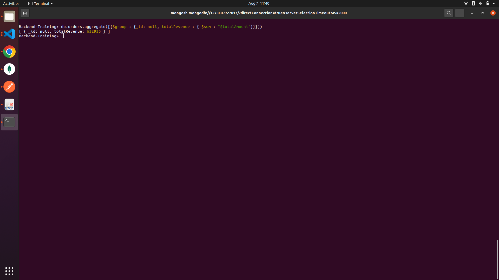;
---

### 2 Find Total Number of Orders by Status (Pending, Shipped, Delivered)

```js
db.orders.aggregate([
  {
    $group: {
      _id: "$status",
      totalsOrders: { $sum: "$totalAmount" }
    },
  },
]);
```
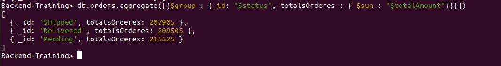;

---

### 3 Find the Top 3 Customers Who Spent the Most

```js
db.orders.aggregate([
  {
    $group: {
      _id: "$customerName",
      totalSpent: { $sum: "$totalAmount" },
    },
  },
  { $sort: { totalSpent: -1 } },
  { $limit: 3 },
]);
```
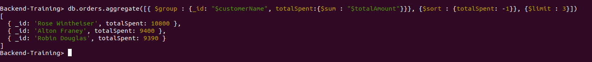;
---

### 4 Get the Average Order Amount per Customer

```js
db.orders.aggregate([
  {
    $group: {
      _id: null,
      averageOrderAmount: { $avg: "$totalAmount" },
    },
  },
]);
```
;
---

### 5 Find Products Sold More Than 10 Times (Total Quantity)

```js
db.orders.aggregate([
  { $unwind: "$items" },
  {
    $group: {
      _id: "$items.productName",
      totalQuantitySold: { $sum: "$items.quantity" },
    },
  },
  {
    $match: {
      totalQuantitySold: { $gt: 10 },
    },
  },
]);
```
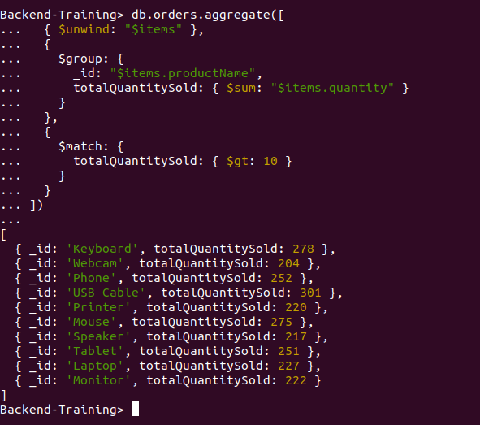;
---

### 6 List Monthly Revenue (Group by Month-Year) for the Last 6 Months

```js
db.orders.aggregate([
  {
    $match: {
      orderDate: {
        $gte: new Date(new Date().setMonth(new Date().getMonth() - 6)),
      },
    },
  },
  {
    $group: {
      _id: {
        year: { $year: "$orderDate" },
        month: { $month: "$orderDate" },
      },
      totalRevenue: { $sum: "$totalAmount" },
    },
  },
  { $sort: { "_id.year": -1, "_id.month": -1 } },
]);
```
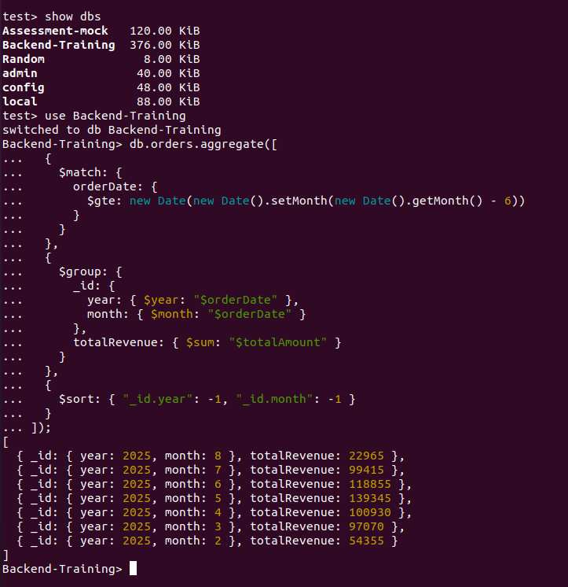;
---

### 7 Find All Customers Who Placed More Than 2 Orders

```js
db.orders.aggregate([
  {
    $group: {
      _id: "$customerId",
      orderCount: { $sum: 1 },
    },
  },
  {
    $match: {
      orderCount: { $gt: 2 },
    },
  },
]);
```
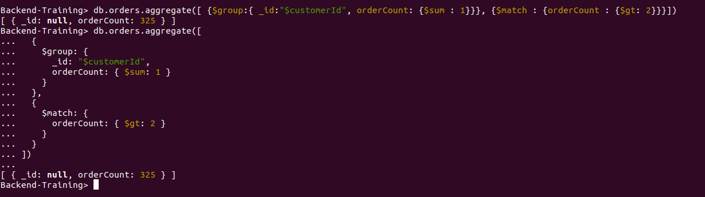;
---

### 8 Calculate Revenue from Only Delivered Orders

```js
db.orders.aggregate([
  { $match: { status: "Delivered" } },
  {
    $group: {
      _id: null,
      totalRevenue: { $sum: "$totalAmount" },
    },
  },
  {
    $project: {
      _id: 0,
      totalRevenue: 1,
    },
  },
]);
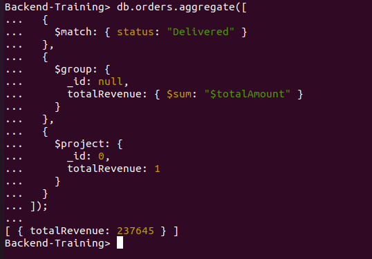;
```

;

### 9 Calculate Total Quantity and Total Revenue per Product

```js
db.orders.aggregate([
  { $unwind: "$items" },
  {
    $group: {
      _id: "$items.productName",
      totalQuantity: { $sum: "$items.quantity" },
      totalRevenue: {
        $sum: {
          $multiply: ["$items.quantity", "$items.price"],
        },
      },
    },
  },
]);
```
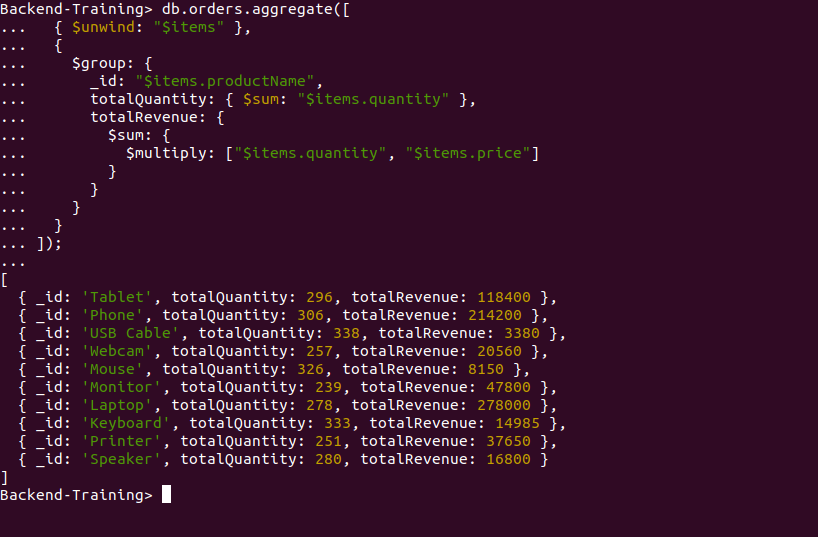;
---

### 10. Extract only the product names from all orders

```js
db.Order.aggregate([
  { $unwind: "$items" },
  {
    $project: {
      _id: 0,
      productName: "$items.productName",
    },
  },
]);
```
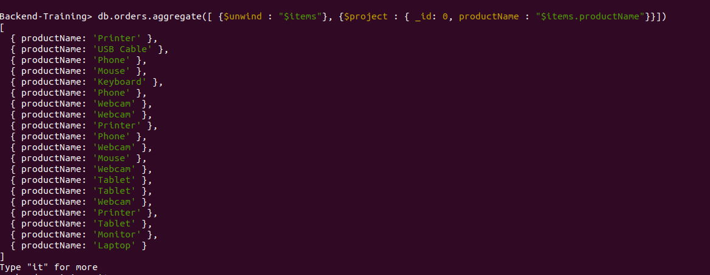;
---

# Indexing and Performance

## 1. Check indexes on the collection.
```js
db.orders.getIndexes();

```
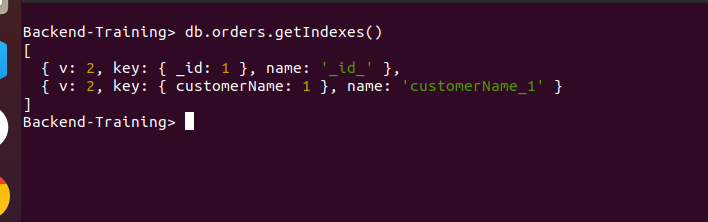;
---

## 2.​ Create an index on customerName. Run a query filtering by customerName and check performance using explain("executionStats").

```js

db.orders.createIndex({ customerName: 1 });

db.orders.find({ customerName: "John Doe" }).explain("executionStats");

```
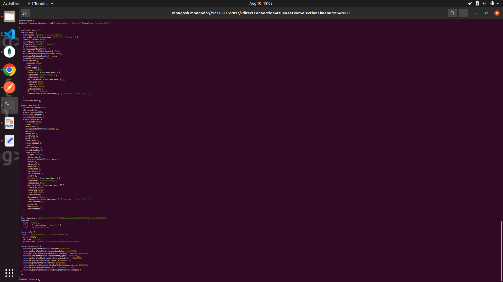;
---

## 3.​ Create a compound index on status and orderDate. Run a query filtering by both and compare performance (before vs after).

```js

db.orders.find({
  status: "Delivered",
  orderDate: { $gte: ISODate("2025-03-01") }
}).explain("queryPlanner");


```
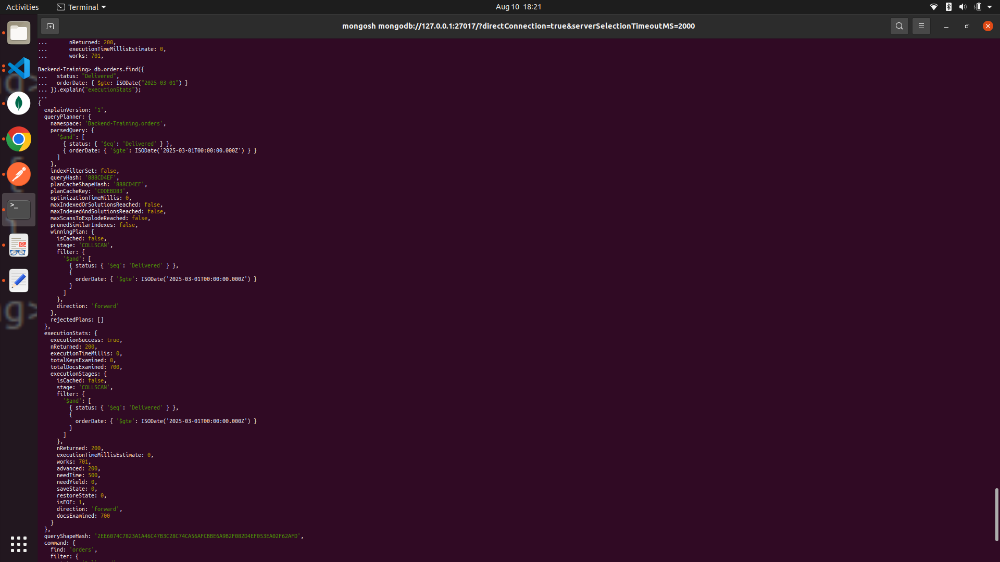;
---

## 4.​ Create a text index on items.productName. Perform a text search for a product.

```js

db.orders.createIndex({ "items.productName": "text" });

db.orders.find({ $text: { $search: "Laptop" } });

```
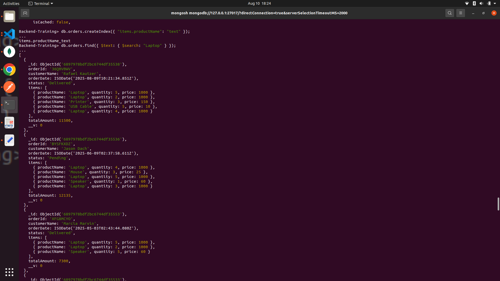;
---

## 5.​ Drop an index and observe performance differenc.

```js

db.orders.dropIndex("status_1_orderDate_-1");

db.orders.find({
  status: "Delivered",
  orderDate: { $gte: ISODate("2025-03-01") }
});

db.orders.find({
  status: "Delivered",
  orderDate: { $gte: ISODate("2025-03-01") }
}).explain("executionStats");

```
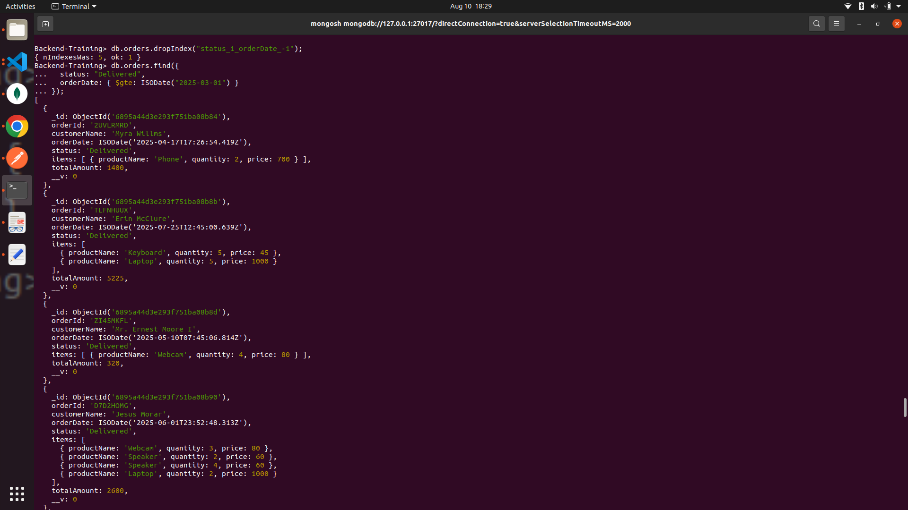
---

## 📝 Notes

- Field names must match your actual schema.
- `$unwind` is essential when working with array fields like `items`.
- Use `$project` to format your final output as needed.
- Dates should be compared with correct JavaScript Date objects.

---
